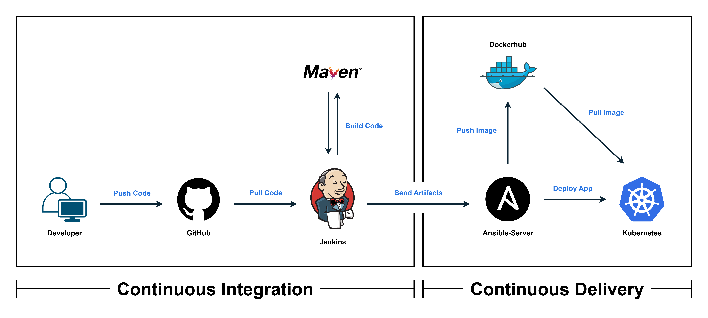

# 🚀 CI/CD Pipeline — Java Application Deployment

> A fully automated CI/CD pipeline for a Java app, using Jenkins, Maven, Docker, and Kubernetes on AWS.

## 🏗️ Architecture Flow  

  

## 📌 Project Overview
This project demonstrates an end-to-end **CI/CD pipeline** for a simple Java-based application running on AWS infrastructure. The pipeline covers everything from source code commit to automated Kubernetes deployment using Jenkins, Maven, Ansible, Docker, and Kubernetes.

The system is divided into two major stages: **Continuous Integration (CI)** and **Continuous Delivery (CD)**.

## 🔧 Continuous Integration (CI)
- The developer pushes code to **GitHub**.  
- A GitHub webhook automatically triggers a **Jenkins CI job**.  
- Jenkins pulls the code and uses **Maven** to build the application.  
- The generated artifact is sent to the **Ansible server**.  
- Ansible builds a **Docker image** and pushes it to **DockerHub**.

**Goal:** Build → Docker Image → Push to DockerHub (Fully Automated)

## 🚀 Continuous Delivery (CD)
- Once the CI job succeeds, Jenkins triggers the **CD job**.  
- **Ansible** connects to the **Kubernetes server** and remotely runs the pre-existing **Kubernetes deployment configuration file**. 
- The application is deployed to a **Kubernetes cluster**.

### Deployment Methods (Testing Purposes)

You can choose to follow **either** of the two methods for testing and deployment:

1. **Method 1 — KIND Cluster (Single EC2 Instance)**
    * A lightweight Kubernetes cluster created using KIND on a single EC2 instance—perfect for testing and development environments.

2. **Method 2 — EKS Multi-Node Cluster**
    * A production-grade Kubernetes cluster setup with:
        * One **control plane node**
        * Two **worker nodes**
    * Ideal for testing in a production-like environment.
    
**Note:**  
For testing purposes, please follow **one** of the above methods based on your preference or environment.

**Goal:** DockerHub → Kubernetes Deployment (Automated Delivery)

## 🎯 Key Highlights
- Fully automated CI/CD pipeline  
- Jenkins, Maven, Ansible, Docker, and Kubernetes working together  
- Deployments tested on both **KIND** and **EKS** clusters  
- All components hosted on AWS  
- Clean separation of CI and CD stages  
- Real-world workflows including webhooks, image publishing, and cluster deployment
